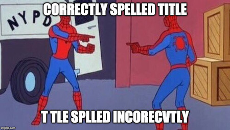

# DoppelSpeller

Finds the best match for a misspelled title.  

## Setup
**Pre-requisite**: Install [Docker](https://docs.docker.com/install/) (tested on the v3.7 engine).
* Setup a environment variable $PROJECT_DATA_PATH (open [settings.py](./doppelspeller/settings.py) to see how it is used!)
    - Defaults to [./data/](./data/)
* `make --always-make build`
* `make generate-lsh-forest`
* `make prepare-data-for-features-generation`
* `make generate-train-and-evaluation-data-sets`
* `make train-model`
* `make prepare-predictions-data`
* `make generate-predictions`

train-auc:1	evaluation-auc:0.999882	train-custom-error:7	evaluation-custom-error:213
true_positives, true_negatives, false_positives, false_negatives
(5872, 3845, 128, 155)
